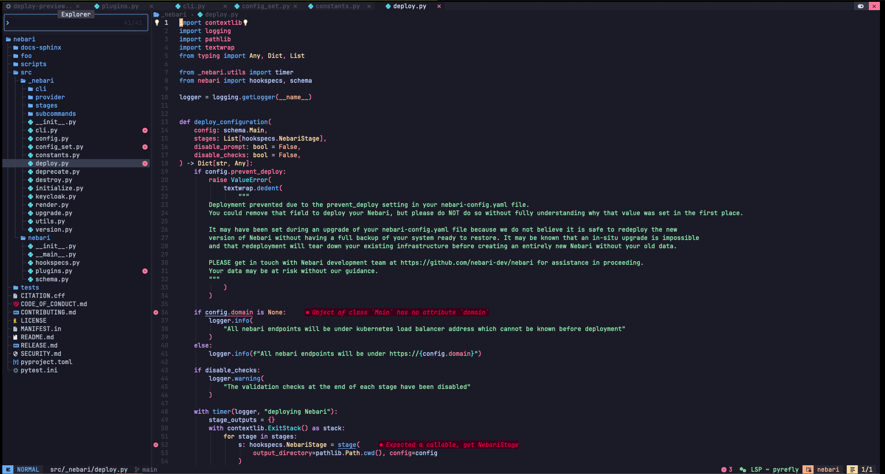
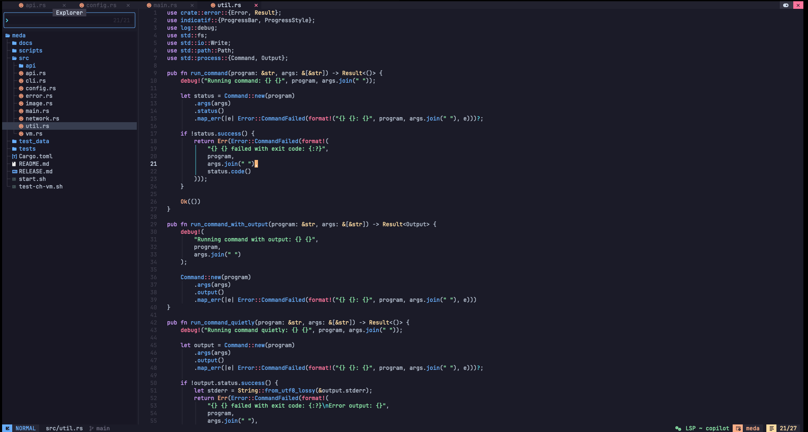
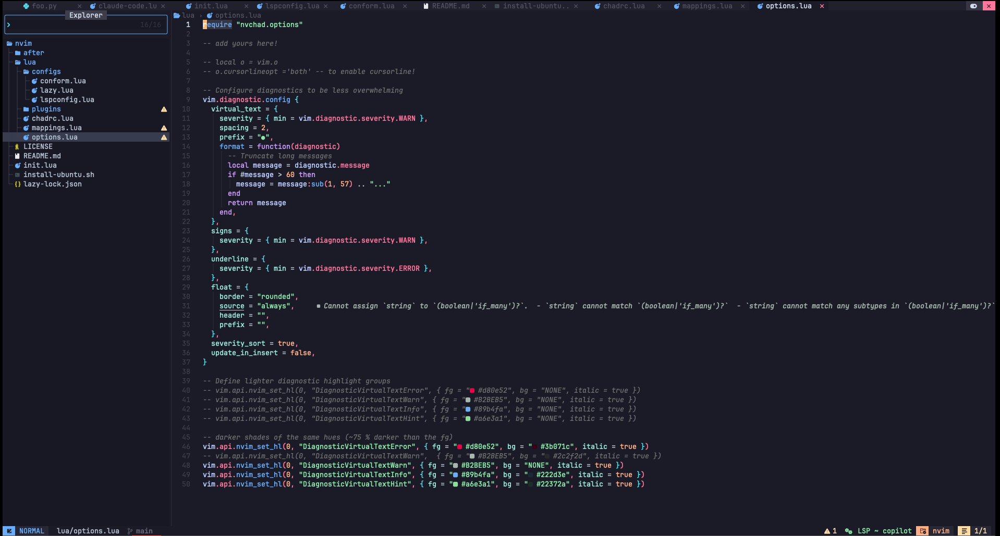

# ✨Neovim Configuration

<div align="center">

[](https://github.com/aktech/neovim-config/actions/workflows/build.yml) [](https://github.com/aktech/neovim-config/actions/workflows/lint.yml)  

*A powerful Neovim configuration built on NvChad v2.5 with AI integration*

</div>

## 📸 Screenshots

<div align="center">

### Python Development


### Rust Development


### Lua Configuration


</div>

## 🛠️ Installation

### Ubuntu/Debian
```bash
# Download and run the installation script
curl -fsSL https://raw.githubusercontent.com/aktech/neovim-config/main/install-ubuntu.sh | bash
```

### macOS
```bash
# Install dependencies
brew install chafa lua viu lazygit pngpaste fzf colorscript font-fira-code bash-language-server shellcheck
brew install --cask kitty

# Install language servers
npm install -g @microsoft/compose-language-service bash-language-server
go install github.com/docker/docker-language-server/cmd/docker-language-server@latest
pip install pyrefly ruff python-lsp-server[all]

# Clone configuration
git clone https://github.com/aktech/neovim-config.git ~/.config/nvim
```

### Manual Installation
```bash
# Backup existing config
mv ~/.config/nvim ~/.config/nvim.backup.$(date +%Y%m%d_%H%M%S)

# Clone this configuration
git clone https://github.com/aktech/neovim-config.git ~/.config/nvim

# Start Neovim (plugins will auto-install)
nvim
```

## 🔧 Troubleshooting

**Rust Analyzer not working:**
```bash
rustup component add rust-analyzer
```

**Python LSP conflicts:**
- Uninstall `pylsp` from Mason to use conda environment version

**Missing language servers:**
```bash
# Check what's missing
:checkhealth
# Install via Mason
:Mason
```

